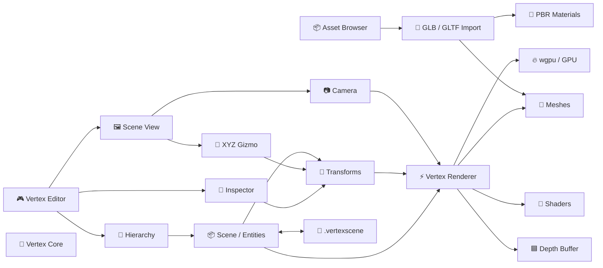

# Vertex Engine


**Sponsorship & Collaboration:** hunterkritik@gmail.com
> A Rust-first, open-source 2D & 3D game engine aiming for a modern Unity/Unreal-style workflow. 🦀🎮

Vertex Engine is an experimental game engine built from the ground up with Rust, wgpu, and an editor UI.

## 🚀 Current Status

**Early development — v0.1.x**

- ✅ Rust workspace architecture
- ✅ wgpu GPU renderer and render pipeline
- ✅ 3D camera and projection matrices
- ✅ Depth-buffer based 3D rendering
- ✅ Real mesh rendering
- ✅ Scene/entity transforms
- ✅ Hierarchy + Inspector editor
- ✅ Viewport object picking
- ✅ W/E/R transform modes
- ✅ Camera orbit, pan and zoom
- ✅ .vertexscene save/load
- ✅ Undo/Redo scene snapshots
- 🚧 Interactive XYZ gizmo dragging
- 🚧 Selected-object outline/highlight
- ✅ GLB/GLTF asset browser and import pipeline
- ✅ GLTF multi-primitive mesh import
- ✅ GPU vertex/index buffer upload for imported meshes
- ✅ PBR material factor import (albedo/metallic/roughness)
- ✅ Imported texture path references
- ✅ Stable asset + node + primitive references in .vertexscene
- 🚧 Asset thumbnails and filesystem auto re-import
- 🚧 Physics, animation and audio
- 🚧 Scripting and game export

## 🎮 Editor Controls

| Input | Action |
|---|---|
| **W** | Translate mode |
| **E** | Rotate mode |
| **R** | Scale mode |
| **Left click** | Select/interact with viewport |
| **Right mouse drag** | Orbit camera |
| **Middle mouse drag** | Pan camera |
| **Mouse wheel** | Zoom |
| **Undo / Redo** | Revert or restore scene changes |
| **Save / Load** | Save or load .vertexscene |

## 🧩 Architecture

### Interactive Architecture Map

The repository architecture is also available as a Mermaid diagram. On GitHub, you can use the diagram controls provided by the viewer/browser to inspect the graph; for true **zoom + pan + draggable nodes**, see the interactive editor roadmap.



### 📦 Asset Pipeline

Vertex Engine can now import GLB/GLTF content into the editor, preserve node/primitive references, upload primitive geometry into GPU vertex/index buffers, and map core PBR material factors.

```text
GLB / GLTF
    ↓
Nodes + Primitives
    ↓
Vertices + Indices + Materials
    ↓
GPU Buffers (wgpu)
    ↓
Scene View
```

### 🖱️ Diagram Options

| Option | Status |
|---|---|
| Zoom / inspect architecture | ✅ Mermaid viewer |
| Pan / move around diagram | ✅ Viewer/browser dependent |
| Draggable nodes | 🚧 Planned interactive architecture viewer |
| Collapse/expand systems | 🚧 Planned |
| Click subsystem → source/docs | 🚧 Planned |
| Live scene/editor graph | 🚧 Planned |


## 🛠️ Run

Requirements: Rust stable, a desktop platform supported by wgpu, and suitable GPU drivers.

```bash
git clone https://github.com/hunterkritik-byte/Vertex-Engine.git
cd Vertex-Engine
cargo run -p vertex-editor
```

Verify the workspace:

```bash
cargo check --workspace
cargo test --workspace
```

## 🗺️ Roadmap

### v0.1 — Rendering Foundation
- [x] GPU renderer
- [x] 3D camera
- [x] Depth buffer
- [x] Mesh rendering
- [x] Basic editor

### v0.2 — Editor Foundation
- [x] Hierarchy
- [x] Inspector
- [x] Scene selection
- [x] Transform modes
- [x] Camera navigation
- [x] Scene persistence
- [x] Undo/Redo
- [ ] Interactive XYZ gizmo
- [ ] Selection outline

### Future
- [x] Asset browser/importer
- [x] GLB/GLTF multi-primitive import
- [x] GPU mesh upload
- [x] PBR material mapping
- [x] Stable imported asset references
- [ ] Asset thumbnails
- [ ] Automatic file-change re-import
- [ ] Materials and textures
- [ ] Lighting and shadows
- [ ] Physics
- [ ] Animation
- [ ] Audio
- [ ] Scripting API
- [ ] Prefabs
- [ ] Packaging and game export

## 🤝 Contributing

Vertex Engine is early-stage. Contributions, renderer improvements, editor tooling, and architecture ideas are welcome.

Before submitting changes:

```bash
cargo fmt --all
cargo check --workspace
cargo test --workspace
```

## 📄 License

MIT
